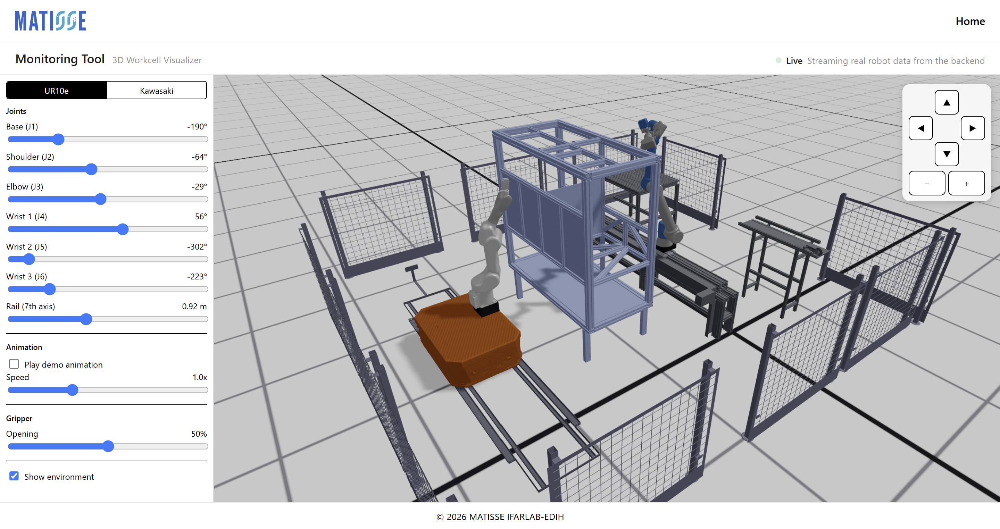
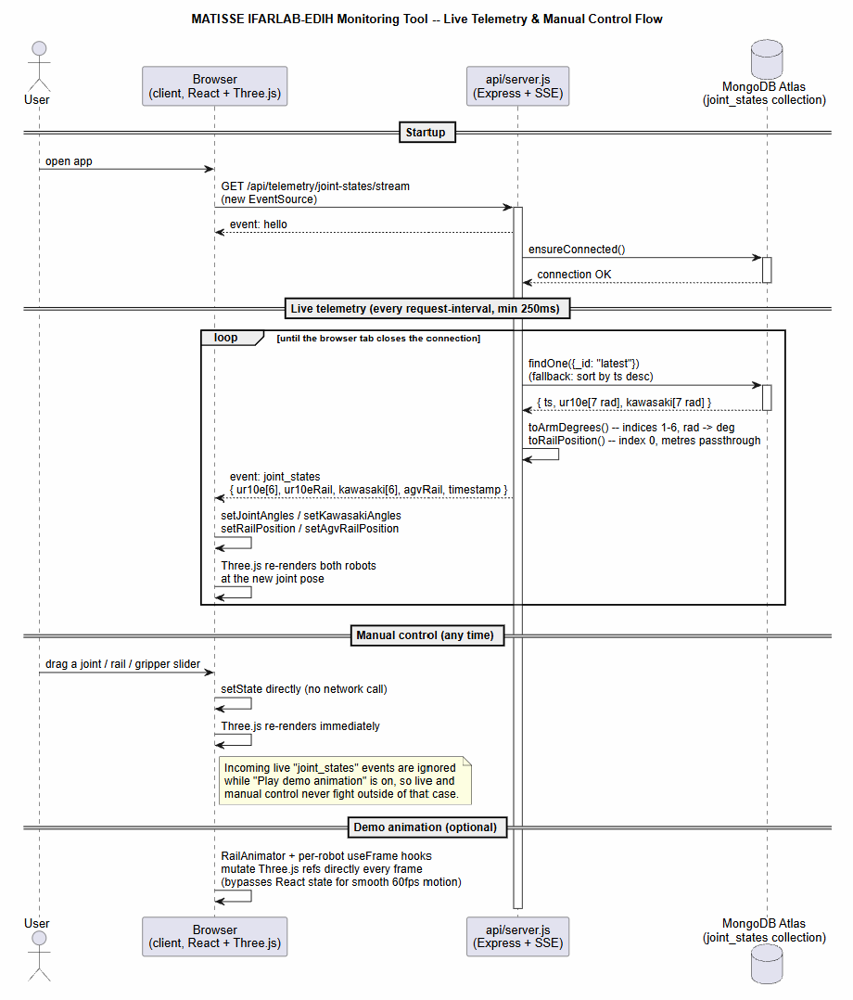

# MATISSE IFARLAB-EDIH Monitoring Tool



A browser-based **3D digital twin** for a two-robot workcell (a Universal Robots **UR10e** and a Kawasaki **RS005L** mounted on an AGV). It renders both robots from their real CAD/URDF mesh geometry, drives them either from **live telemetry stored in MongoDB Atlas** or from **manual on-screen controls**, and reproduces the original Gazebo simulation environment (safety fencing, cabinet, table, conveyor, AGV floor rail) around them.

The project is a small monorepo with two independent Node projects:

| Folder | What it is |
|---|---|
| [`client/`](client) | React + Three.js single-page app — the 3D viewer and control UI |
| [`api/`](api) | Express backend that streams the latest robot joint state from MongoDB to the client over Server-Sent Events |

---

## Features

- **Two fully-articulated robots**, built joint-by-joint from their actual STL meshes (not primitives):
  - **UR10e** — 6 rotational joints + a 7th linear rail axis (`UR10eMount`), plus a mounted 2-finger gripper.
  - **Kawasaki RS005L** — 6 rotational joints, mounted on an **OTA AGV mobile base** (`AGVBase`) that itself rides a 7th linear floor-rail axis, plus its SCHUNK EGP-50 gripper.
- **Live mode** — an `EventSource` connection streams real joint angles from MongoDB Atlas every ~250 ms; a **Live / Connecting / Offline** indicator in the header shows the connection state at a glance.
- **Manual mode** — every joint (6 per robot), each robot's 7th rail axis, and the gripper opening can be dragged by hand in the control panel; live updates are simply skipped while "Play demo animation" is on, so manual and live control never fight each other outside of that.
- **Demo animation** — a scripted, collision-aware "scan" motion for both arms plus rail sliding, driven by direct Three.js ref mutation (not React state) so it stays smooth at 60 fps.
- **Gazebo-accurate environment** — the floor fencing, cabinet, table, conveyor, chassis and AGV rail are the actual meshes from the original Gazebo world (`ifarlab.sdf`), positioned using the world's real coordinate frame and the robots' real spawn poses from the ROS 2 launch files, not guesswork.
- **Manual camera controls** — an on-screen rotate/zoom button cluster (top-right of the viewport) that does the same thing as left-click-drag (orbit) and scroll (zoom), for anyone who doesn't want to use the mouse gestures.
- **Responsive** — the control panel becomes a slide-in drawer on mobile, the navbar collapses to just a logo + Home link, and the layout adapts down to phone widths.

## Tech stack

**Frontend** (`client/`)
- [React 18](https://react.dev/) (Create React App / `react-scripts`)
- [react-three-fiber](https://docs.pmnd.rs/react-three-fiber) — React renderer for [Three.js](https://threejs.org/)
- [`@react-three/drei`](https://github.com/pmndrs/drei) — `OrbitControls`, `Html` helpers
- Plain CSS, no UI framework

**Backend** (`api/`)
- Node.js + [Express](https://expressjs.com/)
- [`mongodb`](https://www.npmjs.com/package/mongodb) official driver — reads from MongoDB Atlas
- Server-Sent Events (native `res.write`, no socket library) for the live stream
- `cors`, `dotenv`

## How it works



Quick-glance text version of the same flow:

```
MongoDB Atlas (joint_states collection)
        │  polled every request-interval (min 250 ms)
        ▼
api/server.js  ──HTTP GET /api/telemetry/joint-states/stream (SSE)──▶  client (EventSource)
        │                                                                     │
        │ converts raw doc → { ur10e:[6 deg], ur10eRail, kawasaki:[6 deg], agvRail }
        │                                                                     ▼
        │                                                        React state in DigitalTwin.js
        │                                                                     │
        └── api/debug.js: same Mongo read, prints to console (no HTTP)        ▼
                                                                   Three.js scene re-renders
                                                                   robots at the new joint angles
```

Each MongoDB document stores `ur10e` and `kawasaki` as **7-element arrays, in radians**: index 0 is the linear/prismatic "7th axis" (the UR10e's rail carriage position, or the AGV's position along its own floor rail), and indices 1–6 are the six arm joints in URDF order. `api/server.js` drops nothing — it converts the 6 rotational values to degrees for the arm, and passes the 7th value straight through in metres — and streams the result as a `joint_states` SSE event. The client's `EventSource` listener applies it directly to React state, which flows down into the Three.js joint groups.

The PlantUML source behind the diagram above is [`docs/sequence-diagram.puml`](docs/sequence-diagram.puml) — edit it and re-render with any PlantUML renderer (e.g. the PlantUML VS Code extension, or [plantuml.com](https://www.plantuml.com/plantuml)) if the flow changes.

### 3D asset sourcing

The STL meshes under `client/public/meshes/` come directly from the two robots' real ROS description packages (`Universal_Robots_ROS2_Description` for the UR10e, and the project's own `mobile_manipulator_description` for the Kawasaki + AGV + facility). Joint offsets and axes were taken from the packages' `.xacro` files, not eyeballed — see the comments at the top of `UR10eRobot.js` and `KawasakiRobot.js` for the exact joint table. The facility/environment layout in `EnvironmentElements.js` reconstructs the original `ifarlab.sdf` Gazebo world: every static prop's raw STL coordinates already encode its true position in that world's shared frame, and the robots' spawn poses were taken from `whole_ifarlab_gazebo.launch.py`, so the whole scene lines up without hand-placed guesswork. A few small furniture pieces (chassis, table, conveyor) have no matching xacro/launch entry in the source repo, so their placement is a best-effort reading of their own raw coordinates rather than a verified one — see the comments in `EnvironmentElements.js` for exactly which pieces that applies to.

## Project structure

```
monitoring-tool/
├── api/                          Express + SSE backend
│   ├── server.js                 npm start — the HTTP/SSE server the client talks to
│   ├── debug.js                  npm run debug — one-off/console CLI dump of the latest Mongo doc
│   └── .env                      MONGODB_URI, DB_NAME, COLLECTION_NAME, PORT (not committed)
│
└── client/                       React app
    ├── public/
    │   ├── assets/logo/          MATISSE logo
    │   └── meshes/               STL meshes served to the browser
    │       ├── ur10e/            UR10e arm + rail carriage + gripper
    │       ├── rs005l/           Kawasaki RS005L arm + gripper
    │       ├── ota/              AGV (OTA) mobile base + wheels
    │       └── environment/      Facility props (fencing, cabinet, ifarlab_ray rail)
    └── src/
        ├── App.js / App.css      App shell: Navbar + page + Footer
        ├── components/
        │   ├── Navbar.js / Footer.js
        │   ├── Scene.js          Lighting + procedural grid-texture floor
        │   ├── UR10eRobot.js      UR10e kinematic chain + gripper
        │   ├── UR10eMount.js      UR10e's 7th-axis rail carriage
        │   ├── KawasakiRobot.js  Kawasaki kinematic chain + gripper
        │   ├── AGVBase.js         OTA mobile base + wheels
        │   ├── RailAnimator.js    Drives rail sliding during demo mode (ref-based, no re-render)
        │   ├── EnvironmentElements.js  Static workcell/facility meshes
        │   └── ControlPanel.js / .css  Sidebar UI (joints, rail, gripper, animation, environment)
        └── pages/
            └── DigitalTwin.js / .css   Main page: layout, SSE client, camera, robot placement
```

## Getting started

### Prerequisites
- Node.js 18+ (developed on Node 24)
- A MongoDB Atlas cluster with a `joint_states` collection (see [Data model](#data-model) below)

### 1. Backend

```bash
cd api
npm install
cp .env.example .env   # if you don't already have one — see Environment variables below
npm start               # starts the SSE server on http://localhost:3001
```

You should see:
```
API listening: http://localhost:3001
MongoDB Atlas connection successful.
```

To just sanity-check the Mongo connection without the web server, use the CLI tool instead:
```bash
npm run debug        # polls and prints the latest document, Ctrl+C to stop
npm run debug:once   # prints once and exits
```

### 2. Frontend

```bash
cd client
npm install
npm start   # dev server, defaults to http://localhost:3000
```

Open the printed URL in a browser. The app talks to the backend at `http://localhost:3001/api` by default (see `REACT_APP_API_URL` below to point it elsewhere).

For a production build: `npm run build` (outputs to `client/build/`, serve with any static file server).

## Environment variables

**`api/.env`**

| Variable | Required | Default | Purpose |
|---|---|---|---|
| `MONGODB_URI` | yes | — | Atlas connection string |
| `DB_NAME` | no | `ifarlabmatisse_db_user` | Database name |
| `COLLECTION_NAME` | no | `joint_states` | Collection name |
| `PORT` | no | `3001` | Port the SSE server listens on (Render sets this automatically) |
| `CORS_ORIGIN` | no | *(allow all)* | Comma-separated list of allowed frontend origins in production, e.g. `https://your-app.vercel.app`. Leave unset for local dev. |
| `POLL_INTERVAL_MS` | no | `1000` | `debug.js` only — how often it re-polls Mongo (min 250) |

**`client/.env`** (optional)

| Variable | Default | Purpose |
|---|---|---|
| `REACT_APP_API_URL` | `http://localhost:3001/api` | Base URL the client's `EventSource` connects to |

## Data model

Each document in the `joint_states` collection looks like:

```jsonc
{
  "_id": "latest",           // server.js/debug.js always read this one first
  "ts": "2026-08-03T11:02:48.652Z",
  "ur10e":    [/* 7 numbers, radians: [rail_axis, shoulder_pan, shoulder_lift, elbow, wrist_1, wrist_2, wrist_3] */],
  "kawasaki": [/* 7 numbers, radians: [agv_rail_axis, joint1, joint2, joint3, joint4, joint5, joint6] */]
}
```

If no document has `_id: "latest"`, both `server.js` and `debug.js` fall back to the most recent document by `ts`.

## Using the app

- **Navbar** — MATISSE logo (left) and Home (right); minimal by design.
- **Live badge** (top-right of the secondary header) — green/blinking "Live" once real telemetry is flowing, gray "Connecting" while the SSE connection is establishing, red "Offline" if the backend can't be reached.
- **Robot tabs** (top of the sidebar) — switch the control panel between UR10e and Kawasaki; each robot keeps its own joint/rail state independently.
- **Joints** — one slider per rotational joint (±360°) plus a "Rail (7th axis)" slider in metres for that robot's linear axis. Sliders are disabled while demo animation is playing, and are overwritten by live data unless animation is on.
- **Animation** — "Play demo animation" runs a safe, repeatable scan/inspect motion (ignores live/manual joint values while active); "Speed" scales how fast it runs.
- **Gripper** — one slider (0–100% opening) shared by both robots' grippers.
- **Show environment** — toggles the facility props (fencing, cabinet, table, conveyor, chassis, AGV rail) on/off, leaving just the two robots and the floor.
- **3D viewport** — left-click drag to orbit, right-click drag to pan, scroll to zoom, or use the ▲◀▶▼ / +/− button cluster in the top-right corner for the same gestures without a mouse.

## Known limitations

- A handful of environment meshes (`chassis.stl`, `alumuniumtable.stl`, `conveyorbelt.stl`) have no corresponding entry in any `.xacro` or launch file in the source repo, so their on-screen position is a best-effort reading of their own raw coordinates rather than a verified placement — see the comment block at the top of `EnvironmentElements.js`.
- The backend has no authentication — it's meant to run behind a trusted network/VPN or be fronted by your own auth layer before exposing it publicly.
- `api/.env` is git-ignored on purpose; you must supply your own Atlas credentials to run the backend.
